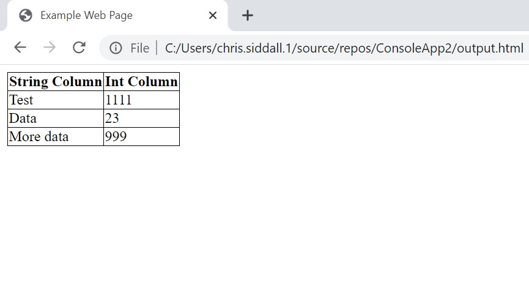
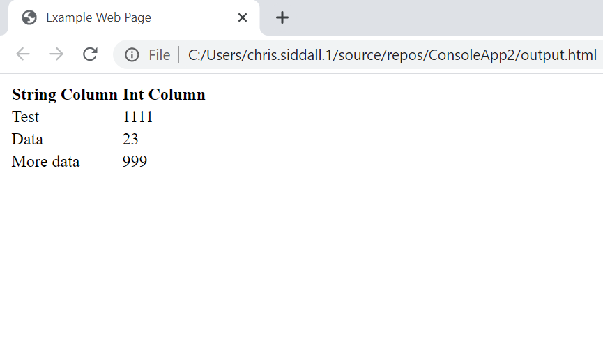

# Scriptable Template

ScriptableTemplate is a .NET Framework C# library I developed to remove code and text duplication in a generic way. Duplicated code and text is held within templates. Output files are then created via embedded script within the templates as well as C# code which parameterises the script according to it's own purpose.

## Example Useage

I have used this for creating classic ASP web pages which follow the same general structure and contain a lot of repeated code by deriving from the 'Template' class and using templates for the web page and child controls. The resulting .asp files are produced according to a single C# class per output file which contains the page specific values and parameters. The benefits of this are the removal of repeated code (#1 rule of pragmatic programming...), an increase in productivity, as well as the ability to make wholesale changes to an entire application by changing the intermediary templates which the application is produced from.

I have also used this for generating statically parameterisable SQL stored procedures and views which share the same concepts and repeated code but with the performance benefits of inline SQL as opposed to moving anything that is repeated in to sub SQL views and functions. Also, bug fixes to the shared code this can be deployed to all of the SQL functions and views which use it by a click of a button.  

ScriptableTemplate will benefit any code/text that is repetitive, but the full applications of it is only limited by your imagination!

## Notes

I created this on my lunch break at work because I could see it being a massive benefit to the productivity of my department at the time. Particularily on the 2 classic ASP applications we supported and developed due to the large swathes of repeated / similar code they both contained. Subsequently the syntax of the template script language this uses has been centered around the ease of parsing by a computer (to arrive at a working application quicker) as opposed to the ease of readability for a human. I would definitely consider improving the syntax in future versions if it was going to be used heavily and I had the resources to do it. Features that are missing or that could be improved:
- The ability to comment the script code does not exist.
- Whitespace in between text and script in templates carries to the output file.

## Example

This is a simple example that can be used to create a HTML page based on a set of parameters and a dynamic dataset to illustrate basic useage of ScriptableTemplate. It consists of a HTML file which contains the static HTML template and the embedded script to output the dynamic parts, as well as a .cs file that uses the ScriptableTemplate engine to parameterise and use the template to generate the output file.

### template.html

Script is encapsulated in between {} blocks. To escape a '{', use '{{'. The full features and keywords that are available can be found by reading the ScriptableTemplate class code.

```
<!DOCTYPE html>

<html>
<head>
	<title>{var:Title}</title>
	<style>
		{if:IsTrue(var:TableBorder)}
		table, th, td {{
			border: 1px solid black;
			border-collapse: collapse;
		}
		{endIf}
	</style>
</head>
<body>
	<table>
		<thead>
			<tr>
				{for:i = 0 to func:subtract(var:ColumnCount,1)}
					<th>{var:Column[var:i]}</th>
				{endFor}
			</tr>
		</thead>

		<tbody>
			{for:iRow = 0 to func:subtract(var:RowCount,1)}
				<tr>
				{assign:iterRow = var:Row[var:iRow]}
				{for:iColumn = 0 to func:subtract(var:ColumnCount,1)}
					<td>{var:iterRow[var:iColumn]}</td>
				{endFor}
				</tr>
			{endFor}
		</tbody>
	</table>
</body>
</html>
```

### Main.cs

Includes a main entry point to generate the output file when the application is executed.

```
using System.Collections.Generic;
using Sid.ScriptableTemplate;

namespace ConsoleApp2
{
	class Program
	{
		static void Main(string[] args)
		{
			var templ = new Template();
			templ.TemplateDirectory = "..\\..\\";

			// Parameters
			var variables = new System.Collections.Generic.Dictionary<string, object>();
			variables.Add("Title","Example Web Page");
			var columnHeadings = new string[] { "String Column", "Int Column" };
			variables.Add("Column",columnHeadings);
			variables.Add("ColumnCount", columnHeadings.Length);
			variables.Add("TableBorder", true); // Toggle this on/off

			var data = GetDynamicData();
			variables.Add("Row", data);
			variables.Add("RowCount", data.Length);

			System.IO.File.WriteAllText("..\\..\\output.html", templ.FormatTemplate("template.html", variables));
		}

		// Dynamic data e.g. via executing a SQL query
		// To access column values from a row use array index notation
		static object[] GetDynamicData()
		{
			var rv = new List<object[]>();
			rv.Add(new object[] { "Test", 1111 });
			rv.Add(new object[] { "Data", 23 });
			rv.Add(new object[] { "More data", 999 });
			return rv.ToArray();
		}
	}
}
```

### Output File

This is the output file produced by the above application when viewed in a web browser.



This is the output file produced by the above application but with the 'TableBorder' variable specified as 'false' in Main.cs.



